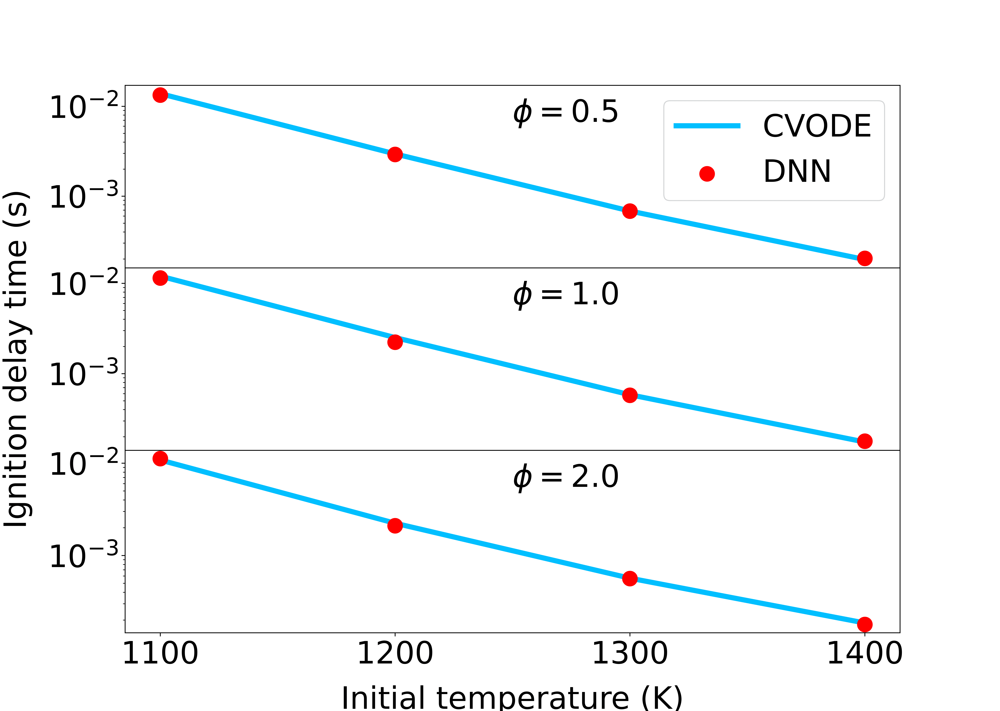
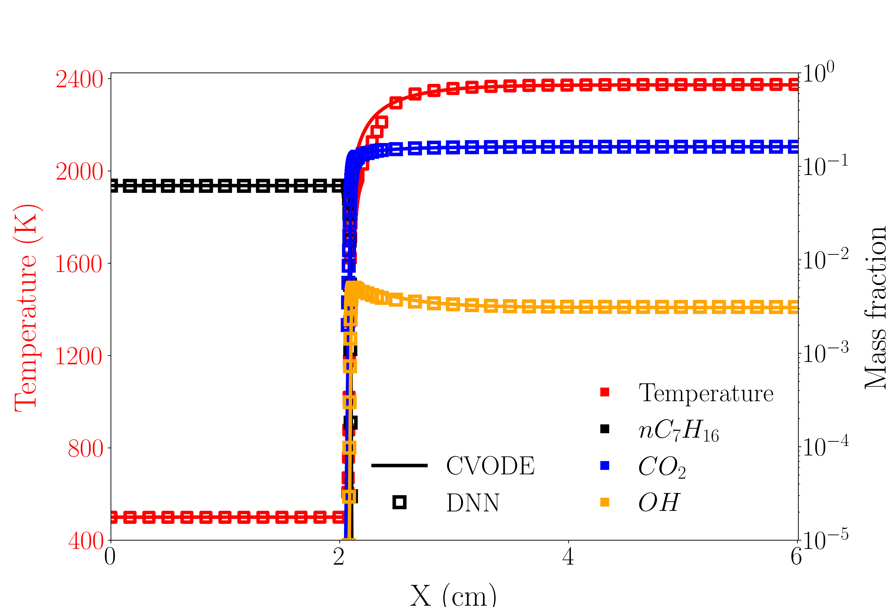
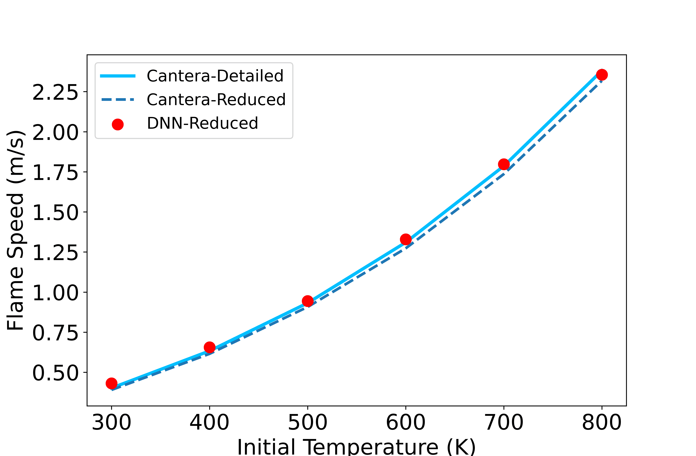
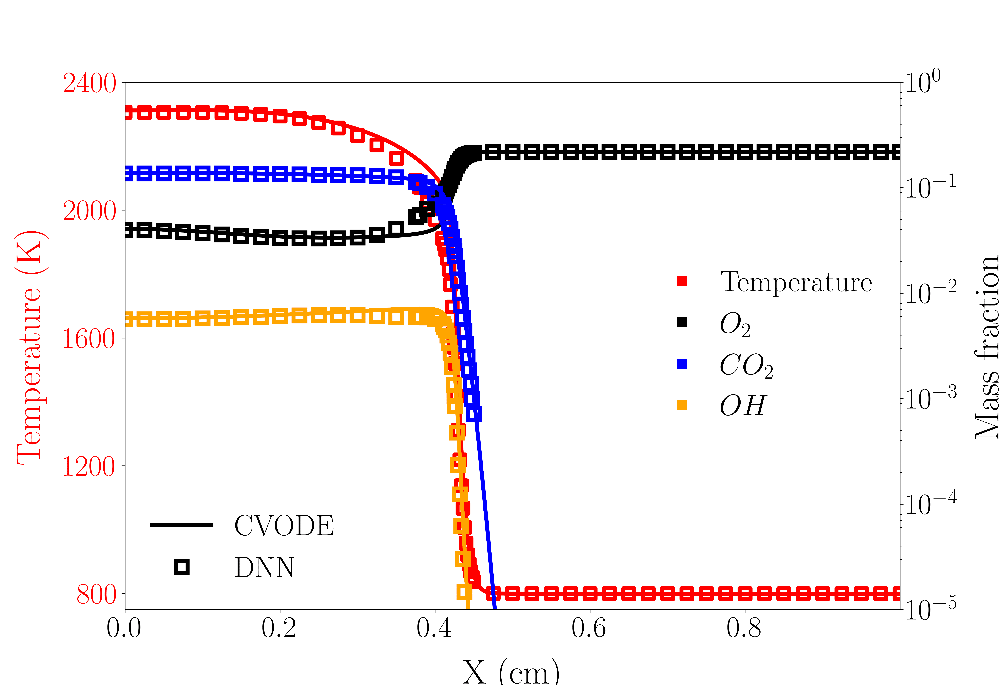
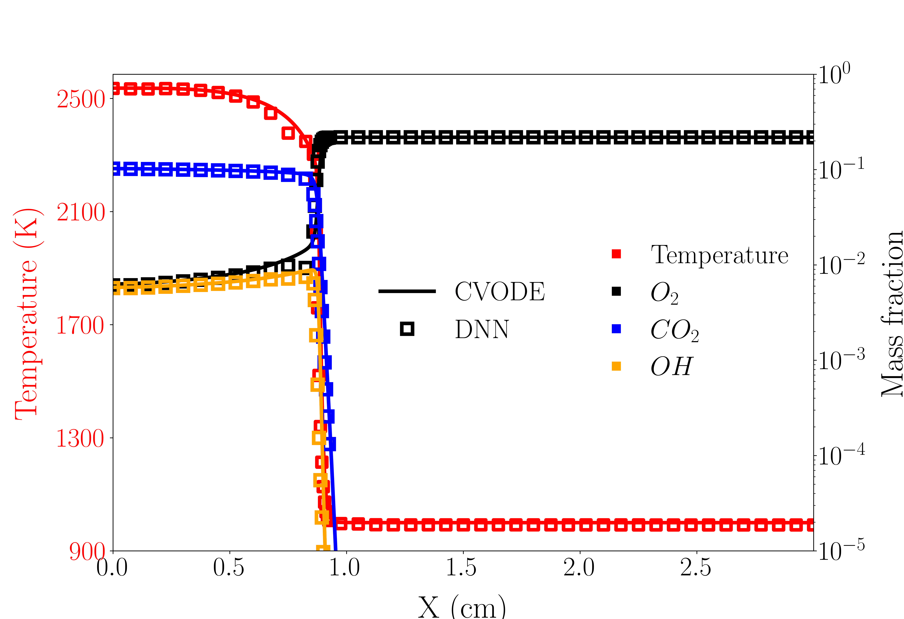

## n-heptane (nC7H16)

Date: Feb 19, 2023; Maintainer: Junjie Yao.

A deep-learning based surrogate model for n-heptane_DeePMR34 mechanism obtained by DeePMR(Available for zero-dimensional auto-ignition and flame propagation).

## Table of contents
- [Basic Info](#basic-info)
- [DNN Details](#dnn-details)
- [Files Description](#files-description)
- [DNN Validation](#dnn-validation)

### Basic Info
**Mechanism** : *nheptane_DeePMR34* Mech see ```mechanism/n-heptane_DeePMR34.yaml```

**Species_num** : _34_

**Reactions_num** : _191_

**DNN_time_step** : _1e-6s_

**Working_condition** : Zero-dimensional homogeneous ignition under constant pressure with the following initial condition $(T,P,\phi)$ in $[1200K,2000K],[0.5atm,2atm],[0.5,3]$, respectively.

### DNN Details
**data_format** : _34_ -dimensional state vector consists of temperature (K), pressure (atm) and mass fraction (Y, the order of species should conform with the mechanism we provide.)

**pre-conditions** : 
- Apply BCT operator 

    $$\mathcal{F}(x)=\frac{x^\lambda-1}{\lambda},\quad \lambda=0.1$$
     
    on dimension denoting the mass fraction.

- Normalization 
    
    $$\mathcal{N}(X)=\frac{X-input\_mean}{input\_std}$$
    
    `input_mean` and `input_std` is the `mean` and `std` of input data. See `checkpoint/norm.json` . 

**DNN input** : the _28_-dimensional state vector after the pre-conditions.

**DNN structure** : feed-forward full-connected

$$u_{\theta}(x)=W^{[L-1]}\sigma\circ(W^{[L-2]}\sigma\circ(\dots(W^{[1]}\sigma\circ(W^{[0]}x+b^{[0]})+b^{[1]})\dots)+b^{[L-2]})+b^{[L-1]}$$ 

where $W^{[l]}\in\mathbb{R}^{m_{l+1}\times m_l},b^{[l]}\in \mathbb{R}^{m_{l+1}},m_0=m_L=$ _28_, $\sigma$ denotes the activation function. see ```settings.json```.

**Activation function** :

$$GELU(x)=\frac{x}{2}(1+\tanh(x+0.044715x^3)\sqrt{\frac{2}{\pi}})$$


**How to get state vector after delta_t** ( _1e-6s_ ):


```python
## python pseudo-code
input state 

state_bct = (state[:, 2:]**lam - 1) / lam
state_norm = (state_bct - input_mean) / input_std
output_norm = DNN(state_norm)
output = output_norm * label_std + label_mean
output_bct = output * delta_t + state_bct
output_bct[:, 2:] = (lam * output_bct[:, 2:] + 1)**(1 / lam)

return output_bct
```

### Files Description

- `mechanism/nheptane_DeePMR34.yaml` : chemical mechanism files[<sup>1</sup>](#DeePMR).

- `checkpoint/norm.json` : `mean` and `std` of input and label data for normalization and inverse-normalization.
 
- `checkpoint/settings.json` : basic hyper-parameters for setting and training DNNs.

- `checkpoint/model5000.pt` : DNN parameters in pytorch format. The suffix number denotes the training epoch.

### DNN Validation

Ignition delay time comparison between Cantera (CVODE) and DNN.
 


One-dimensional laminar flame trajectory and flame speed simulated by EBI[<sup>2</sup>](#EBI).
 




Two-dimensional spherical flame simulated by EBI.



Two-dimensional counter flow simulated by EBI.



### Citation

If you use our DNN model in your work, please cite it as follows:

```
@article{ZHANG2022112319,
    title = {A multi-scale sampling method for accurate and robust deep neural network to predict combustion chemical kinetics}, 
    journal = {Combustion and Flame},
    volume = {245},
    pages = {112319},
    year = {2022},
    issn = {0010-2180},
    doi = {https://doi.org/10.1016/j.combustflame.2022.112319},
    url = {https://www.sciencedirect.com/science/article/pii/S0010218022003340},
    author = {Tianhan Zhang and Yuxiao Yi and Yifan Xu and Zhi X. Chen and Yaoyu Zhang and Weinan E and Zhi-Qin John Xu}
}
```

<div id="DeePMR"></div>

[1] [Wang, Zhiwei, et al. "A deep learning-based model reduction (DeePMR) method for simplifying chemical kinetics." arXiv preprint arXiv:2201.02025 (2022).](https://arxiv.org/abs/2201.02025)


<div id="EBI"></div>

[2] [Thorsten Zirwes, Feichi Zhang, Peter Habisreuther, Maximilian Hansinger, Henning Bockhorn, Michael Pfitzner, Dimosthenis Trimis (2020) Quasi-DNS Dataset of a Piloted Flame with Inhomogeneous Inlet Conditions; Flow, Turbulence and Combustion. vol. 104, pp. 997–1027. doi: 10.1007/s10494-019-00081-5](https://link.springer.com/article/10.1007/s10494-019-00081-5)