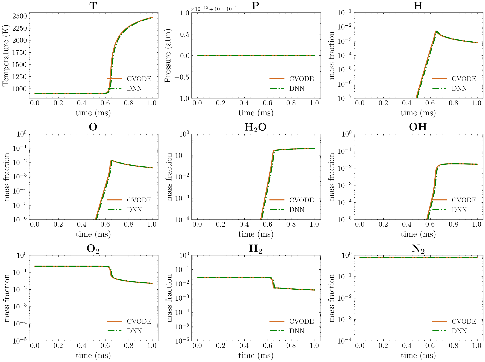
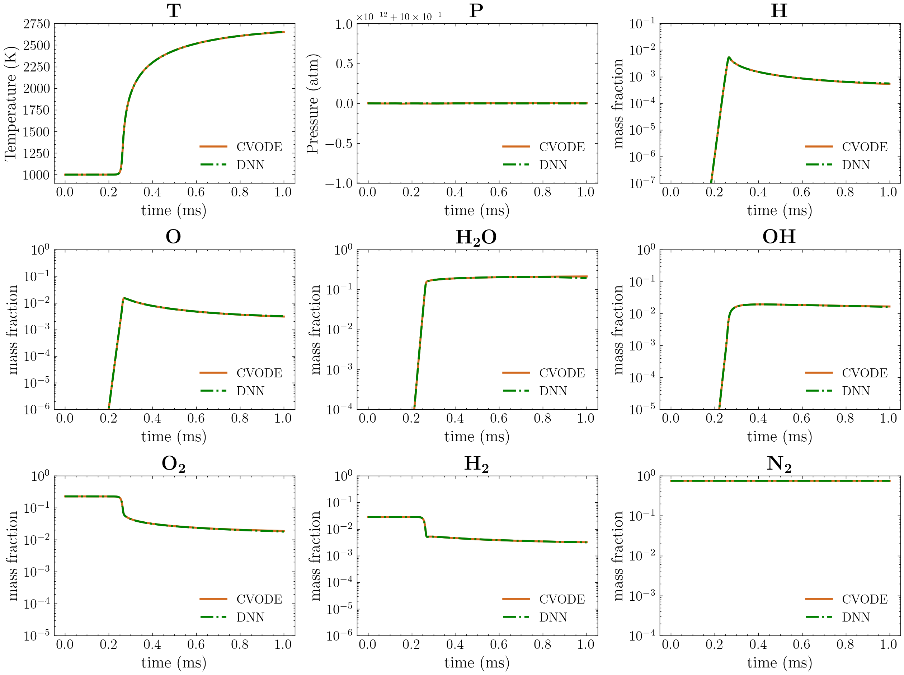
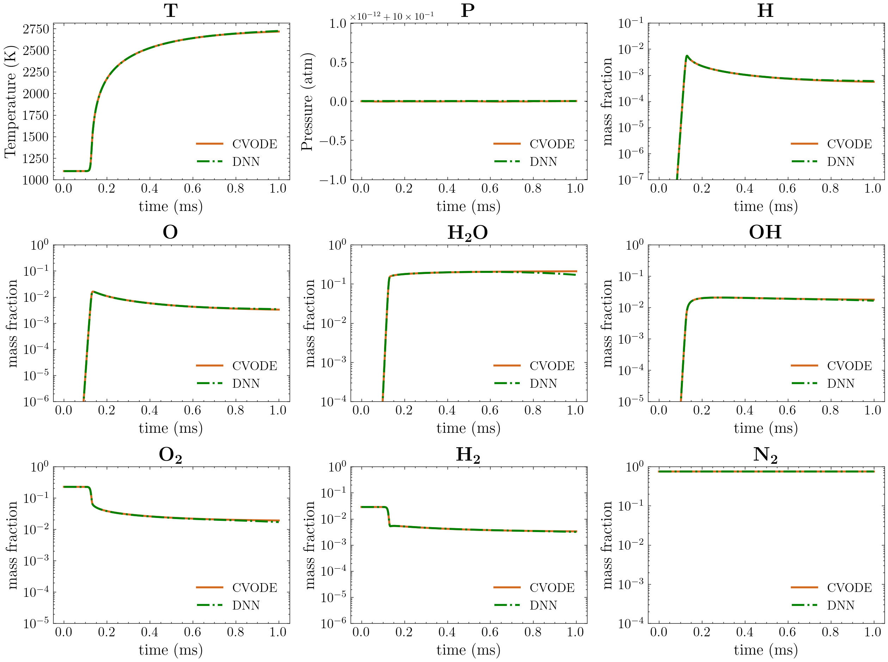
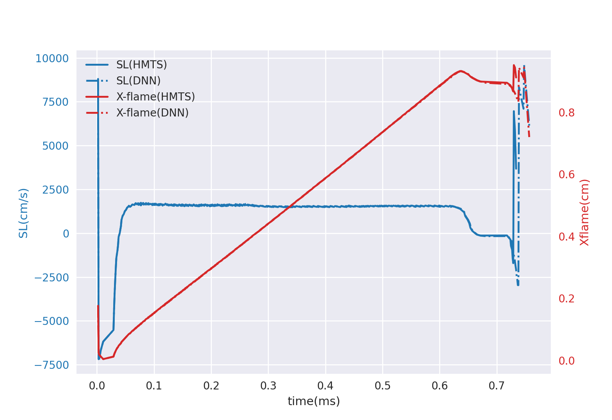
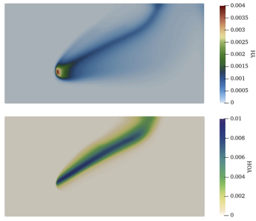
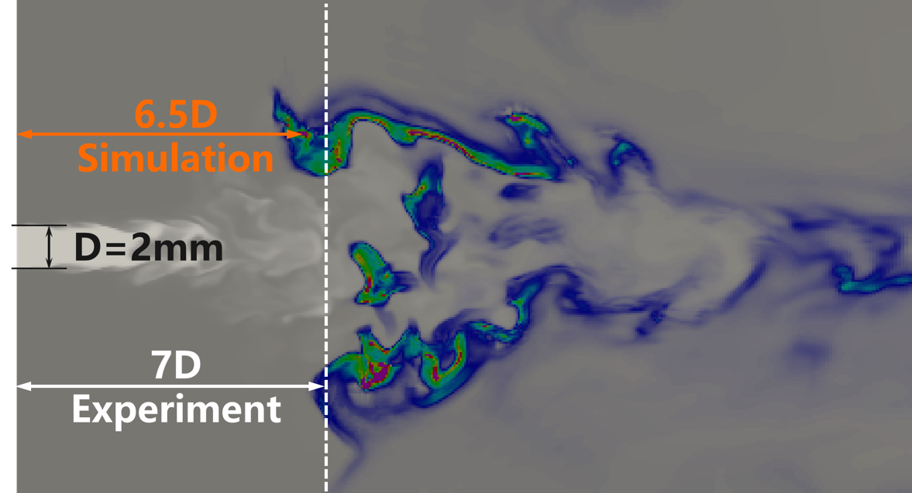

# Hydrogen (H2)

Date: 2022.10.18    Maintainer: Yuxiao Yi

A deep-learning based surrogate model for Evans-Schexnayder H2 mechanism. (Available for zero-dimensional auto-ignition and flame propagation)

## Table of contents
- [Basic Info](#basic-info)
- [DNN Details](#dnn-details)
- [Files Description](#files-description)
- [DNN Validation](#dnn-validation)
- [Citation](#citation)


### Basic Info

**Mechanism** : Evans-Schexnayder H2 mechanism[<sup>1</sup>](#ESH2) , or see [`mechanism/ESH2.yaml`](mechanism/ESH2.yaml)


**Species_num** : *7* (AR is not included)

**Reactions_num** : *16*

**DNN_time_step** : *1e-6*s

**Working_condition** : Zero-dimensional homogeneous ignition and flame propagation under constant pressure with the following condition $(T,P)$ in [900K,3000K],[0.5atm,2atm], respectively.


### DNN Details

**data_format** : `TPY`, *9*-dimensional state vector consists of temperature (K), pressure (atm) and mass fraction (Y, the order of species should conform with the provided mechanism)

**pre-conditions** : 

- Apply BCT operator 

    $$\mathcal{F}(x)=\frac{x^\lambda-1}{\lambda},\quad \lambda=0.1$$

    on the dimensions denoting the mass fraction.
               
- Normalization 

    $$\mathcal{N}(X)=\frac{X-input\_{mean}}{input\_{std}}$$ 
    
    `input_mean` and `input_std` is the `mean` and `std` of input data $X$. See [`checkpoint/norm.json`](checkpoint/norm.json) .

**DNN input** : the *9*-dimensional state vector after the pre-conditions.

**DNN structure** : feed-forward full-connected 

$$u_{\theta}(x)=W^{[L-1]}\sigma\circ(W^{[L-2]}\sigma\circ(\dots(W^{[1]}\sigma\circ(W^{[0]}x+b^{[0]})+b^{[1]})\dots)+b^{[L-2]})+b^{[L-1]}$$ 

where $W^{[l]}\in\mathbb{R}^{m_{l+1}\times m_l},b^{[l]}\in \mathbb{R}^{m_{l+1}},m_0=m_L=9$,  $\sigma$ denotes the activation fucntion. See [`checkpoint/settings.json`](checkpoint/settings.json) 

**Activation function** : 

$$GELU(x)=\frac{x}{2}(1+\tanh(x+0.044715x^3)\sqrt{\frac{2}{\pi}})$$

**How to get state vector after delta_t** `1e-6s`:

```python
## python pseudo-code

input state 

state_bct = (state[:, 2:]**lam - 1) / lam          # BCT
state_norm = (state_bct - input_mean) / input_std  # normalization
output_norm = DNN(state_norm)                      # DNN prediction
output = output_norm * label_std + label_mean      # inverse-normalization
output_bct = output * delta_t + state_bct          
output_bct[:, 2:] = (lam * output_bct[:, 2:] + 1)**(1 / lam) # inverse-BCT

return output_bct
```


### Files Description

- [`mechanism/ESH2.yaml`](mechanism/ESH2.yaml) : chemical mechanism files. CHEMKIN format is also provided.

- [`checkpoint/norm.json`](checkpoint/norm.json) : `mean` and `std` of input and label data for normalization and inverse-normalization.
 
- [`checkpoint/settings.json`](checkpoint/settings.json) : basic hyper-parameters for setting and training DNNs.

- `checkpoint/model5000.pt` : DNN parameters in pytorch format. The suffix number denotes the training epoch.

<!-- - `lossfile/*.png` : the training and validation loss curve. -->

### DNN Validation
 
Zero-dimensional constant-pressure autoignition results comparison between Cantera (CVODE) and
DNN.

- **T=900K, P=1atm, Phi=1**
 
    

- **T=1000K, P=1atm, Phi=2**

    


-  **T=1100K, P=1atm, Phi=1**
    
    


One-dimensional laminar flame trajectory and flame speed simulated by the in-house code `ASURF`[<sup>2</sup>](#ASURF).

- **Initial condition of H2/air mixture: T=600K, P=1atm ,Phi=1**

    


Two-dimensional jet flame simulation results using DNN.

- **DNN prediction for H and OH radials of 2D laminar triple flame.**

    


Three-dimensional jet flame simulation results using DNN.

- **comparison of the final lift-off height between the DNN simulation and experiment.**

    


Further simualtion results could be seen in out paper.[<sup>3</sup>](#CNF)


### Citation

If you use our DNN model in your work, please cite it as follows:

```
@article{ZHANG2022112319,
    title = {A multi-scale sampling method for accurate and robust deep neural network to predict combustion chemical kinetics}, 
    journal = {Combustion and Flame},
    volume = {245},
    pages = {112319},
    year = {2022},
    issn = {0010-2180},
    doi = {https://doi.org/10.1016/j.combustflame.2022.112319},
    url = {https://www.sciencedirect.com/science/article/pii/S0010218022003340},
    author = {Tianhan Zhang and Yuxiao Yi and Yifan Xu and Zhi X. Chen and Yaoyu Zhang and Weinan E and Zhi-Qin John Xu}
}
```


<div id="ESH2"></div>

[1] [J.S. Evans, C.J. Schexnayder, Influence of chemical kinetics and unmixedness on burning in supersonic hydrogen flames, AIAA J. 18 (2) (1980) 188–193, doi:10.2514/3.507](https://arc.aiaa.org/doi/10.2514/3.50747)


<div id="ASURF"></div>

[2] [Z. Chen, M.P. Burke, Y. Ju, Effects of Lewis number and ignition energy on the
determination of laminar flame speed using propagating spherical flames, Proc.
Combust. Inst. 32 (1) (2009) 1253–1260, doi:10.1016/j.proci.2008.](https://www.sciencedirect.com/science/article/pii/S154074890800285X?via%3Dihub)


<div id="CNF"></div>

[3] [Tianhan Zhang, Yuxiao Yi, Yifan Xu, Zhi X. Chen, Yaoyu Zhang, Weinan E, and Zhi-Qin John Xu. A multi-scale sampling method for accurate and robust deep neural network to predict combustion chemical kinetics. Combustion and Flame, 245:112319, 2022.](https://doi.org/10.1016/j.combustflame.2022.112319)
