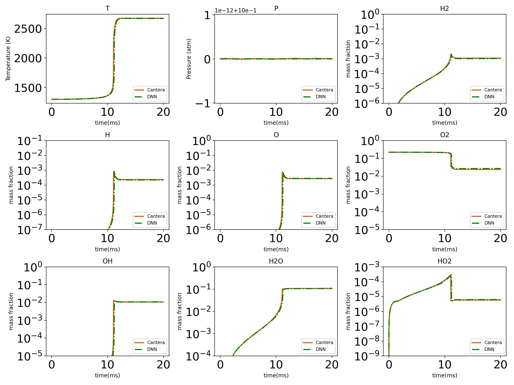
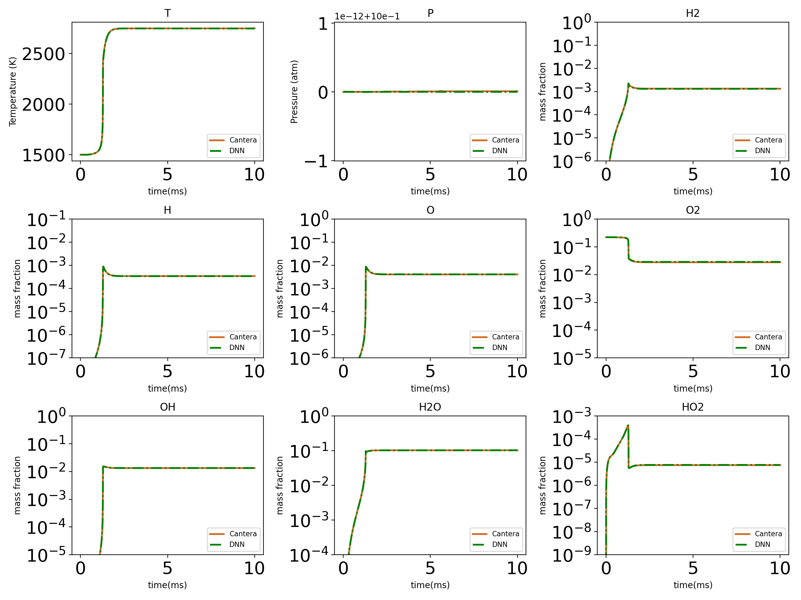
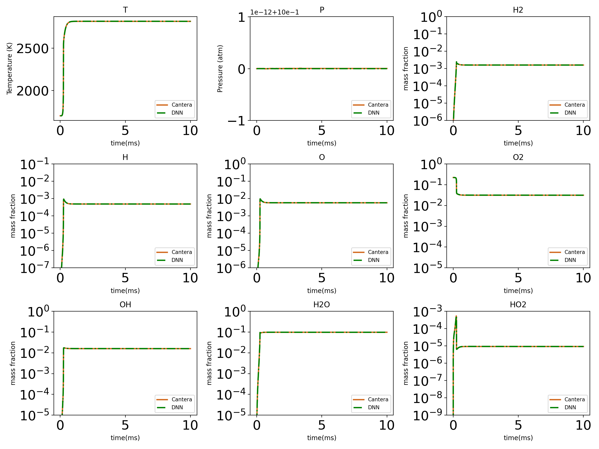
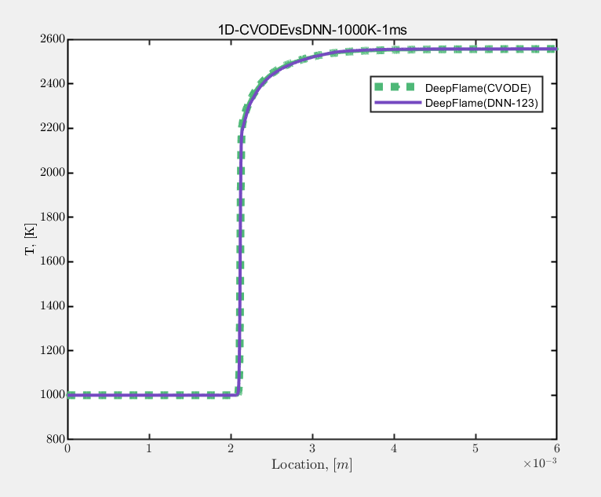

## Methane (CH4)

Date: Oct 21, 2022; Maintainer: Junjie Yao.

A deep-learning based surrogate model for drm19 mechanism (Available for zero-dimensional auto-ignition and flame propagation).

## Table of contents
- [Basic Info](#basic-info)
- [DNN Details](#dnn-details)
- [Files Description](#files-description)
- [DNN Validation](#dnn-validation)

### Basic Info
**Mechanism** : _drm19_ Mech see ```mechanism/drm19.yaml```

**Species_num** : _21_

**Reactions_num** : _84_

**DNN_time_step** : _1e-6s_

**Working_condition** : Zero-dimensional homogeneous ignition under constant pressure with the following initial condition $(T,P,\Phi)$ in $[1200K,2000K],[0.5atm,2atm],[0.5,3]$, respectively.

### DNN Details
**data_format** : _23_ -dimensional state vector consists of temperature (K), pressure (atm) and mass fraction (Y, the order of species should conform with the mechanism we provide.)

**pre-conditions** : 
- Apply BCT operator 

    $$\mathcal{F}(x)=\frac{x^\lambda-1}{\lambda},\quad \lambda=0.1$$
     
    on dimension denoting the mass fraction.

- Normalization 
    
    $$\mathcal{N}(X)=\frac{X-input\_mean}{input\_std}$$
    
    `input_mean` and `input_std` is the `mean` and `std` of input data. See `checkpoint/norm.json` . 

**DNN input** : the _23_-dimensional state vector after the pre-conditions.

**DNN structure** : feed-forward full-connected

$$u_{\theta}(x)=W^{[L-1]}\sigma\circ(W^{[L-2]}\sigma\circ(\dots(W^{[1]}\sigma\circ(W^{[0]}x+b^{[0]})+b^{[1]})\dots)+b^{[L-2]})+b^{[L-1]}$$ 

where $W^{[l]}\in\mathbb{R}^{m_{l+1}\times m_l},b^{[l]}\in \mathbb{R}^{m_{l+1}},m_0=m_L=$ _23_, $\sigma$ denotes the activation function. see ```settings.json```.

**Activation function** :

$$GELU(x)=\frac{x}{2}(1+\tanh(x+0.044715x^3)\sqrt{\frac{2}{\pi}})$$


**How to get state vector after delta_t** ( _1e-6s_ ):

```python
## python pseudo-code
input state 

state_bct = (state[:, 2:]**lam - 1) / lam
state_norm = (state_bct - input_mean) / input_std
output_norm = DNN(state_norm)
output = output_norm * label_std + label_mean
output_bct = output * delta_t + state_bct
output_bct[:, 2:] = (lam * output_bct[:, 2:] + 1)**(1 / lam)

return output_bct
```

### Files Description

- `mechanism/drm19.yaml` : chemical mechanism files. CHEMKIN format is also provided.

- `checkpoint/norm*.json` : `mean` and `std` of input and label data for normalization and inverse-normalization.
 
- `checkpoint/setting*.json` : basic hyper-parameters for setting and training DNNs.

- `checkpoint/model*.pt` : DNN parameters in pytorch format. The suffix number denotes the training epoch.

### DNN Validation

Zero-dimensional constant-pressure autoignition results comparison between Cantera (CVODE) and DNN.

 **T=1300K, P=1atm, Phi=1**
 


 **T=1500K, P=1atm, Phi=1**
 


 **T=1700K, P=1atm, Phi=1**
 


One-dimensional laminar premixed flame results comparison between deepflame and DNN.



### Citation

If you use our DNN model in your work, please cite it as follows:

```
@article{ZHANG2022112319,
    title = {A multi-scale sampling method for accurate and robust deep neural network to predict combustion chemical kinetics}, 
    journal = {Combustion and Flame},
    volume = {245},
    pages = {112319},
    year = {2022},
    issn = {0010-2180},
    doi = {https://doi.org/10.1016/j.combustflame.2022.112319},
    url = {https://www.sciencedirect.com/science/article/pii/S0010218022003340},
    author = {Tianhan Zhang and Yuxiao Yi and Yifan Xu and Zhi X. Chen and Yaoyu Zhang and Weinan E and Zhi-Qin John Xu}
}
```


