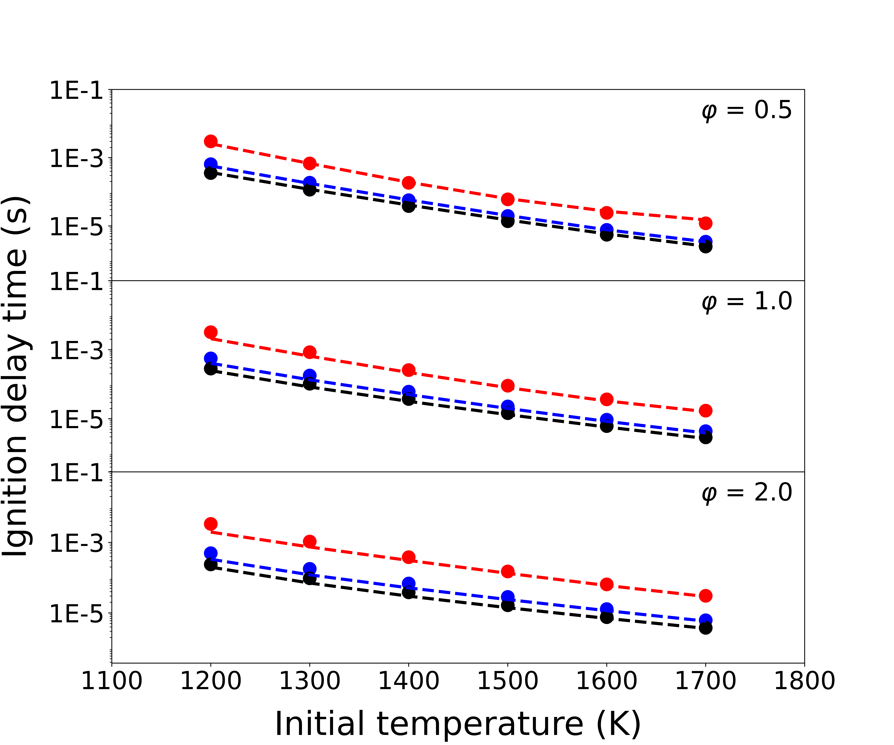

## Reduced model for the n-butane kinetic model (LLNL, 2011) 

Date: Mar 07, 2023; Maintainer: Zhiwei Wang.

### Detailed kinetic model 

- Mechanism: LLNL_n-butane_648sp_detailed.yaml
- See [Mehl M, Pitz W J, Westbrook C K, et al. Kinetic modeling of gasoline surrogate components and mixtures under engine conditions[J]. Proceedings of the Combustion Institute, 2011, 33(1): 193-200.](https://www.sciencedirect.com/science/article/pii/S1540748910000787?casa_token=OIW80_QsZB0AAAAA:I0alvoVky-3dZOqIFU-JCajEKagglHgnYbzjuKiXiD3ixFN7VeriIBfb_scKyTQzN2N_26UyQIk)
- Species num: *648*
- Reactions num: *4846*

### Model reduced by DeePMR

- Mechanism: LLNL_n-butane_21sp_skeletal.yaml
- Species num: *21*
- Reactions num: *138*
- Overall average relative error: *13.3%*

### Working condition

**Zero-dimensional homogeneous ignition under constant pressure**

- initial condition
    - Temperature: *1200 ~ 1700 K*
    - Pressure: *1 ~ 20 atm*
    - Equivalence ratio: *0.5 ~ 2*
- validation
    
    