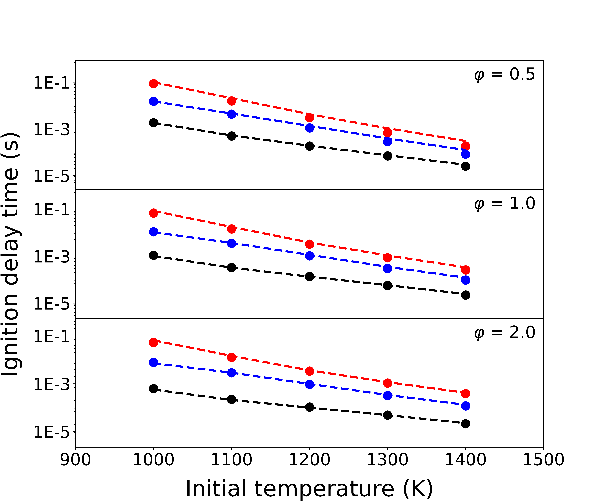

## Reduced model for the n-butane kinetic model (JKL, 2021) 

Date: Mar 07, 2023; Maintainer: Zhiwei Wang.

### Detailed kinetic model 

- Mechanism: JKL_n-butane_341sp_detailed.yaml
- See [Si J, Wang G, Li P, et al (2021) A new skeletal mechanism for simulating MILD combustion optimized using Artificial Neural Network. Energy 237:121,603](https://www.sciencedirect.com/science/article/pii/S036054422101851X)
- Species num: *341*
- Reactions num: *1977*

### Model reduced by DeePMR

- Mechanism: JKL_n-butane_27sp_skeletal.yaml
- Species num: *27*
- Reactions num: *149*
- Overall average relative error: *14.8%*

### Working condition

**Zero-dimensional homogeneous ignition under constant pressure**

- initial condition
    - Temperature: *1000 ~ 1400 K*
    - Pressure: *1 ~ 40 atm*
    - Equivalence ratio: *0.5 ~ 2*
- validation
    
    