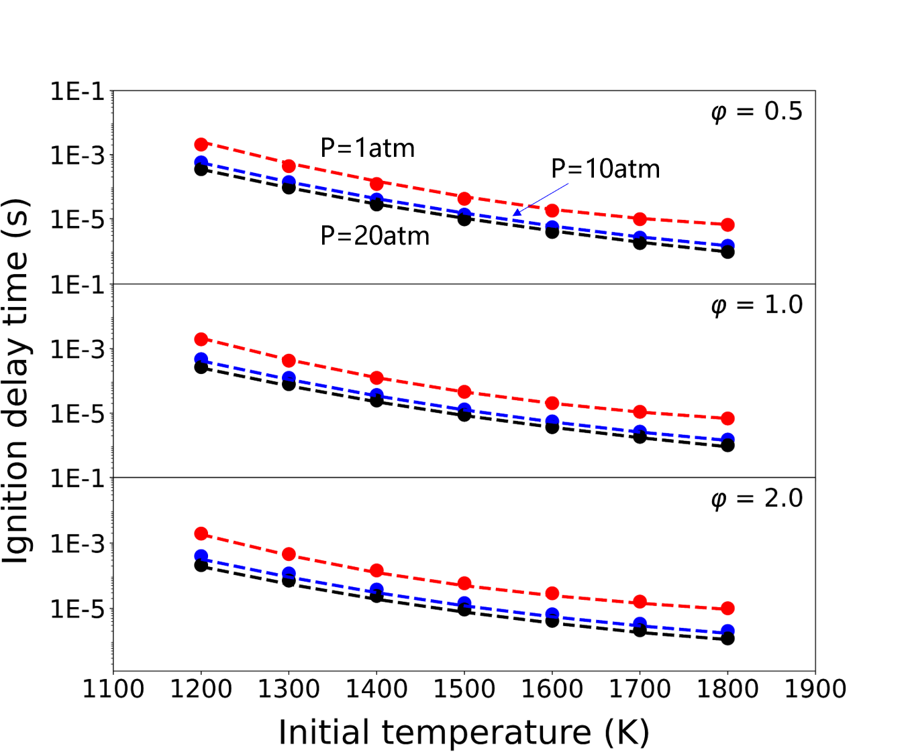
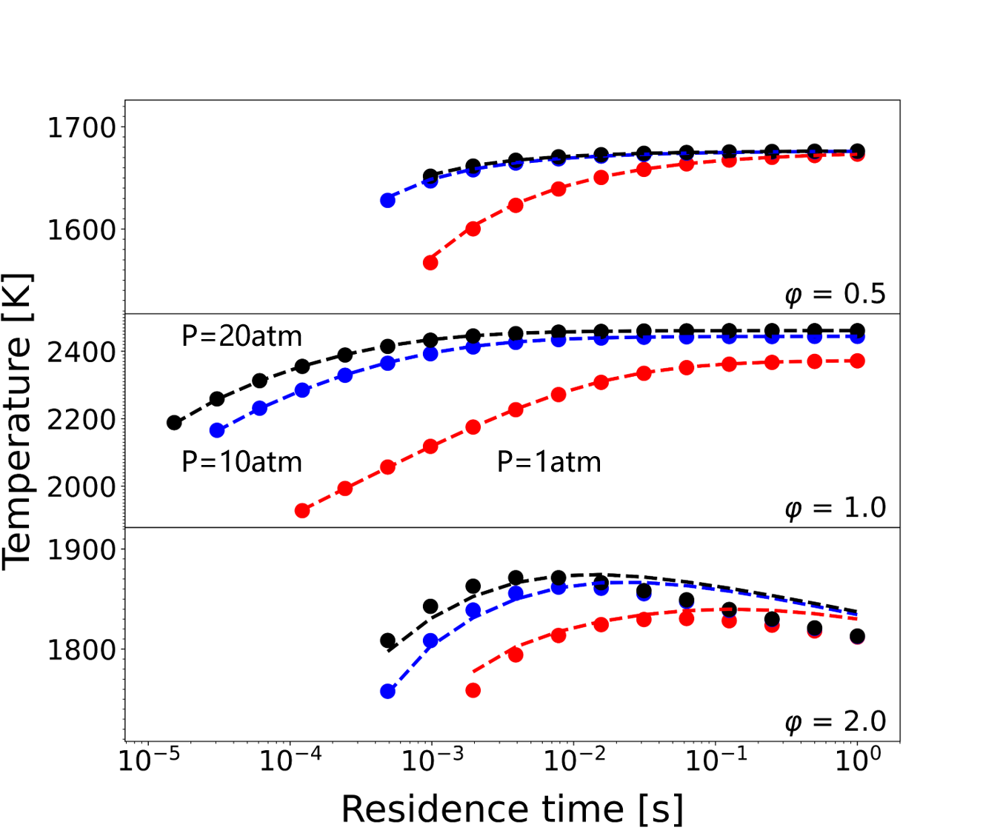
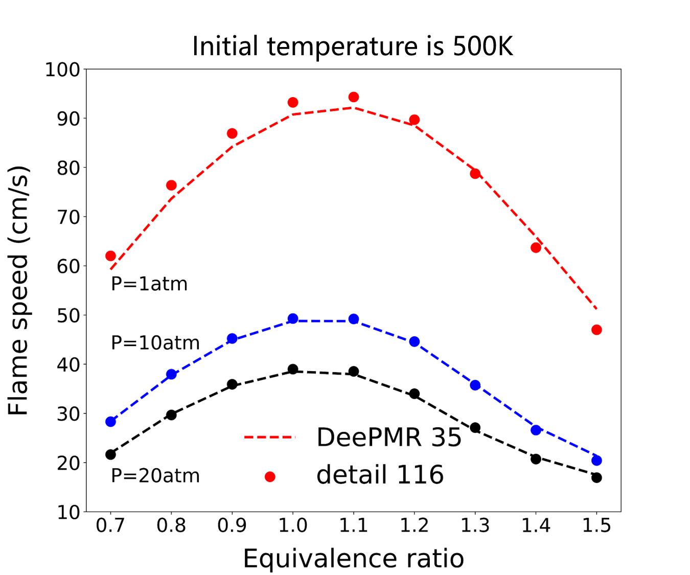
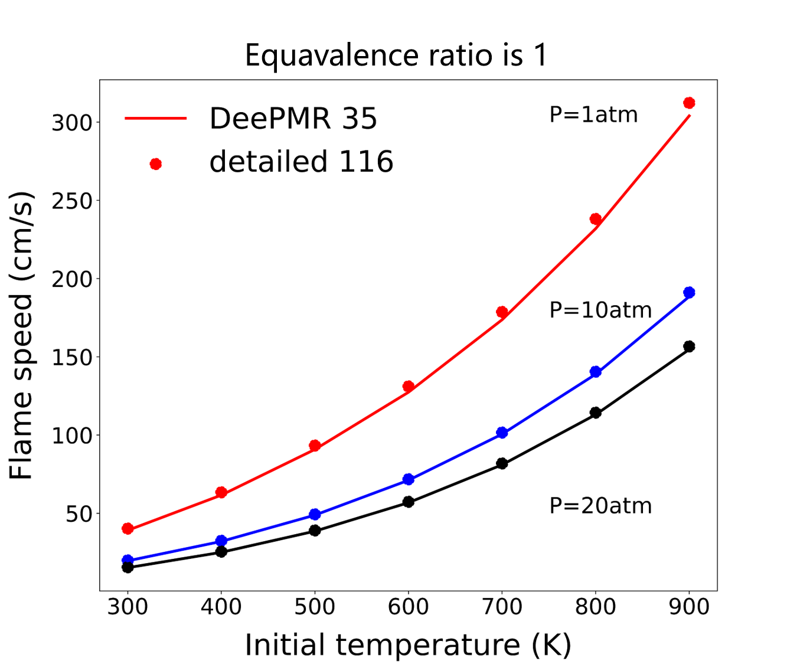
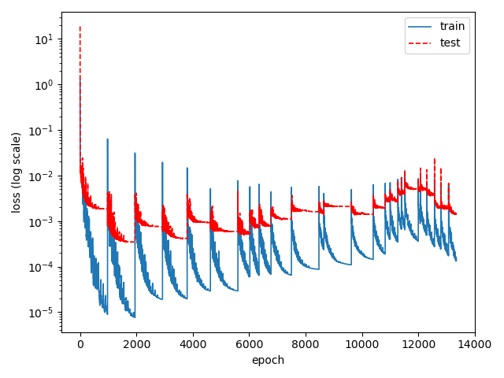

##  Reduced model for the high-temperature n-heptane kinetic model (Dryer, 2007) 

Date: Oct 20, 2022; Maintainer: Zhiwei Wang.

### Detailed kinetic model 

- Mechanism: Dryer_n-heptane_116sp_detailed.yaml
- See: [Chaos M, Kazakov A, Zhao Z, et al. A high‐temperature chemical kinetic model for primary reference fuels[J]. International Journal of Chemical Kinetics, 2007, 39(7): 399-414.](https://onlinelibrary.wiley.com/doi/abs/10.1002/kin.20253?casa_token=c6moaDb5X8cAAAAA:YuDVLaHFZ9_mSmRCt2ghEiAsH12Lbp1IIcXWmx8llSjXFCq0e9fkgvb3e2hwe6wKvPI52dnbqeUTUV0)
- Species num: *116*
- Reactions num: *830*

### Model reduced by DeePMR

- Mechanism: Dryer_n-heptane_35sp_skeletal.yaml
- Species num: *35*
- Reactions num: *192*
- Overall average relative error: *less than 3%*

### Working condition

**Zero-dimensional homogeneous ignition under constant pressure**

- initial condition
    - Temperature: *1200 ~ 1800 K*
    - Pressure: *1 ~ 20 atm*
    - Equivalence ratio: *0.5 ~ 2*
- validation
    

**perfectly stirred reactors**
- initial condition
    - Temperature: *around 500 K*
    - Pressure: *1 ~ 20 atm*
    - Equivalence ratio: *0.5 ~ 2*
- validation
    

**One-dimensional premixed laminar flame** 
- initial condition
    - Temperature: *300 ~ 900 K*
    - Pressure: *1 ~ 20 atm*
    - Equivalence ratio: *0.5 ~ 1.5*
- validation
    

    

### DNN loss
This picture shows the DNN loss history during iterative sampling. The Adam optimizer and mean square loss function are used for training such DNN model.

