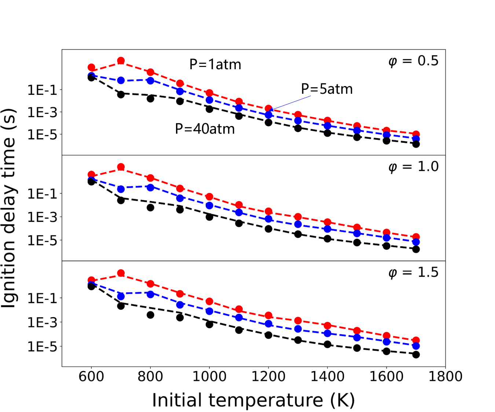
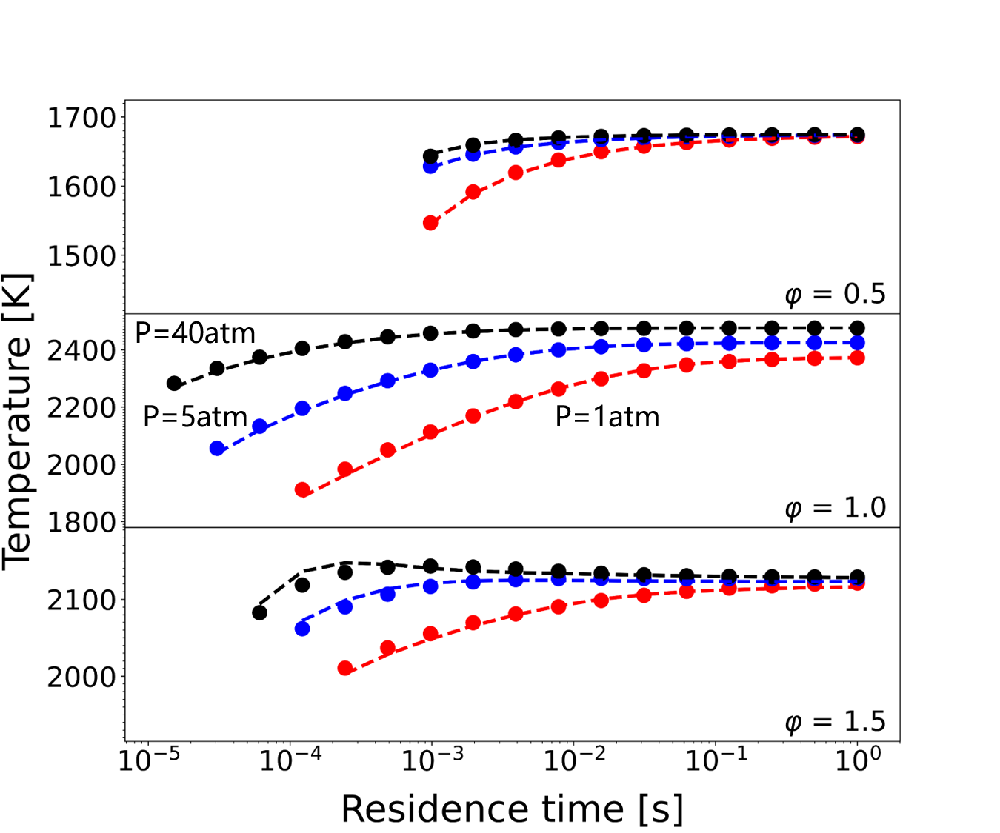
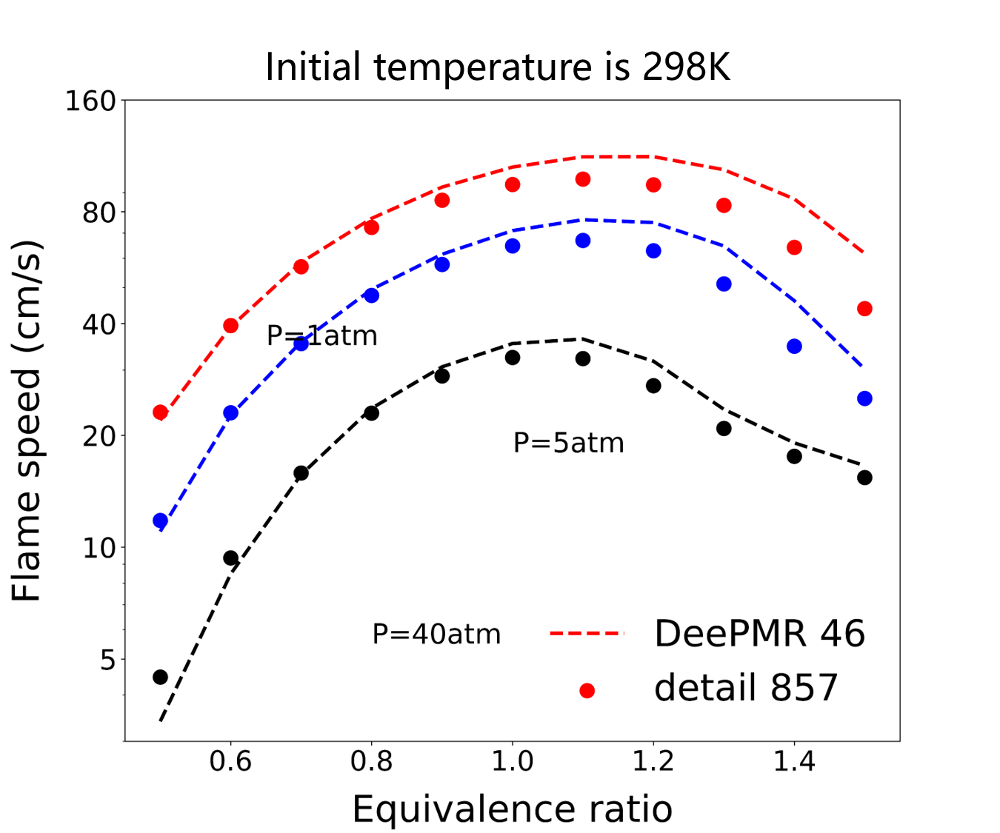
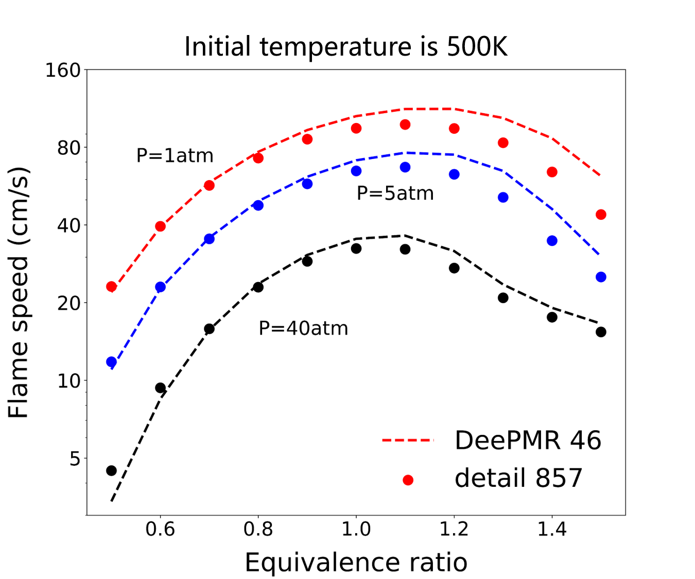
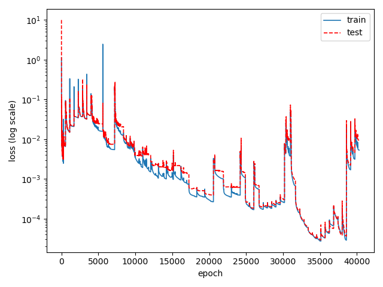

## Reduced model for the iso-octane kinetic model (GMIT, 2002) 

Date: Oct 20, 2022; Maintainer: Zhiwei Wang.

### Detailed kinetic model 

- Mechanism: GMIT_iso-octane_857sp_detailed.yaml
- See [Curran H J, Gaffuri P, Pitz W J, et al. A comprehensive modeling study of iso-octane oxidation[J]. Combustion and flame, 2002, 129(3): 253-280.](https://www.sciencedirect.com/science/article/pii/S001021800100373X?casa_token=KrGC-ED1BQAAAAAA:-yNgs5Ka1W8uqOxt2Eqc4d7yVS6Tz5G4wwvxYRGLZuVNLSzYX9U2YSu4IO8OjveAL-KsovkqV4E)
- Species num: *857*
- Reactions num: *6480*

### Model reduced by DeePMR

- Mechanism: GMIT_iso-octane_46sp_skeletal.yaml
- Species num: *46*
- Reactions num: *301*
- Overall average relative error: *less than 15%*

### Working condition

**Zero-dimensional homogeneous ignition under constant pressure**

- initial condition
    - Temperature: *600 ~ 1700 K*
    - Pressure: *1 ~ 40 atm*
    - Equivalence ratio: *0.5 ~ 1.5*
- validation
    

**perfectly stirred reactors**
- initial condition
    - Temperature: *around 500 K*
    - Pressure: *1 ~ 40 atm*
    - Equivalence ratio: *0.5 ~ 1.5*
- validation
    

**One-dimensional premixed laminar flame** 
- initial condition
    - Temperature: *298 ~ 500 K*
    - Pressure: *1 ~ 40 atm*
    - Equivalence ratio: *0.5 ~ 1.5*
- validation
    

    

### Reaction graph
This picture is the species-reaction graph for reduced iso-octane mechanism. Circles represent species, and black dots represent reactions. Species are colored according to class and sized according to vortex degree.

### DNN loss
This picture shows the DNN loss history during iterative sampling. The SGD optimizer and mean square loss function are used for training such DNN model.
